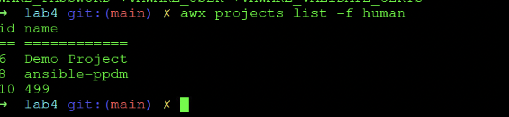
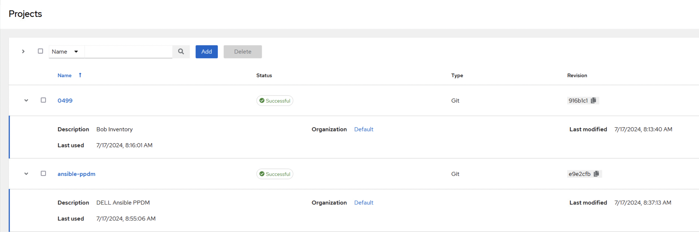
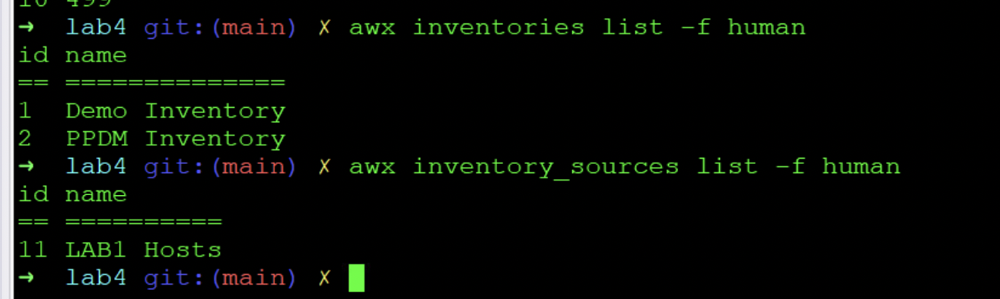
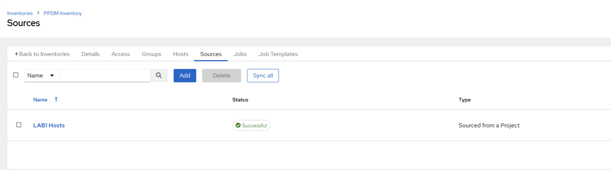

# AWX Buildup
With this lab, we will deploy Templates, Projects and Worklows to the AWX Envirnment, using the AWX CLI  

The execution environment for AWX will be evaluated from lab4 folder

```bash
cd ~/workspace/0499/lab4
direnv allow .
```
## Modify Settings

We use jinja2 native templating in ansible to support PPDM API Enforcement.  
Therefore, we set:

```bash
awx settings modify AWX_TASK_ENV  '{"ANSIBLE_JINJA2_NATIVE": "True"}'
```

## Import Projects

Ansible can Host Project Enfironments on SCM systems. We host our Inventory as well as the ansible_ppdm Modules on Github.  

To import them, we use:

```bash
awx import < 0499.json
awx import < ansible-ppdm.json
```
This should import and sync the 0499 Project containing our Inventory as well the ansible_ppdm roles.


```bash
awx projects list -f human
```






## Importing the Inventory and the Inventory Source 


```bash
awx import < lab1_inventory.json
awx import < lab1.json
```

```bash
awx inventories list -f human
awx inventory_sources list -f human
```





## Creating Credentials

We will create a Custom Credential of type "PPDM Credentials" :

```bash
awx import < credential_type_ppdm.json
```


and the Credentials for our 2 PPDM System:

```bash
awx credentials create --credential_type 'Dell PPDM Credentialsr' --name 'ppdm-2' --user admin  --inputs "{'ppdm_username': 'admin', 'ppdm_password': 'Password123!','ppdm_fqdn': 'ppdm-2.demo.local'}"
awx credentials create --credential_type 'Dell PPDM Credentialsr' --name 'ppdm-1' --user admin  --inputs "{'ppdm_username': 'admin', 'ppdm_password': 'Password123!','ppdm_fqdn': 'ppdm-1.demo.local'}"
```
