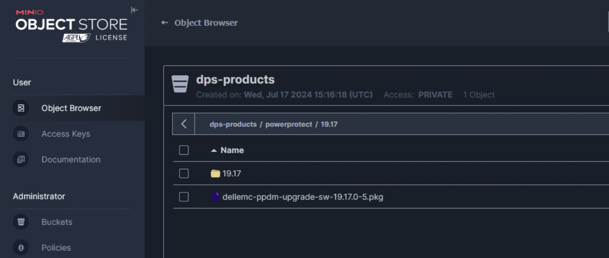
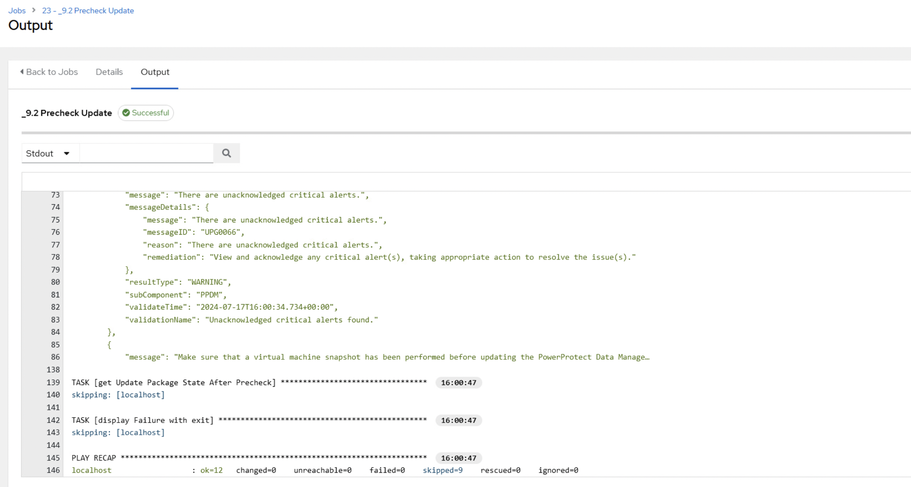
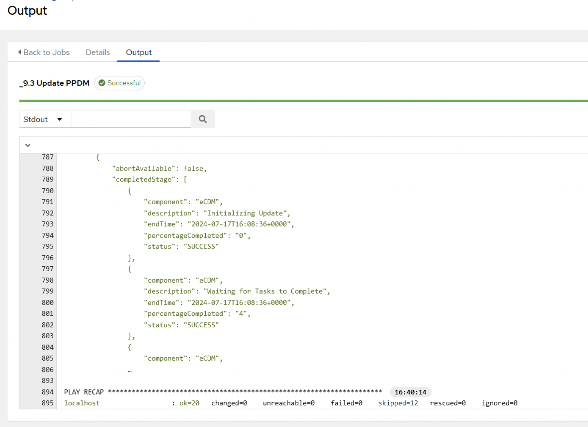

# AWX PPDM Update
With this lab, we will deploy Templates and Worklows for the PPDM Update 


## Update 0499 lab Configuration from Github

```bash
git -C ~/workspace/0499 pull
```

## Change to lab4
The execution environment for AWX will be evaluated from lab4 folder

```bash
cd ~/workspace/0499/lab4
direnv allow .
```


## Importing the Update Job Templates and Workflow

```bash
awx import < update_templates.json
awx import < workflow_update_ppdm.json
```


## Executing the Update Workflow

Before Running the PPDM Update, we need to upload a Package to S3. We can do from ansible host, or from the Webbrowser just uploading the package.
Per default, the Update Package needs to reside in a bucket called dps-products.
It is expected to have a container Structure of powerprotect/{release}, where relase is semver major.minor, e.g. 19.16, 19.17 etc.

when using a different structure,{{ s3_bucket}},{{ s3_container }} and release need to be specified {{ release }} in the workflow

```bash
ansible-playbook ~/workspace/0499/playbooks/s3_upload.yaml -e "package=dellemc-ppdm-upgrade-sw-19.17.0-5.pkg" -e "local_directory=/home/admin/workspace/0499/lab4" -e "release=19.17"
```




Now, we can execute the Workflow:

The Worklow will await some inputs, e.g. the upgrade package and the Major Release


Once we adjusted the required settings, we can hit "Launch"


You will now the the Workflow Graph


The Upload Task will show a result similar to the one below when successfull


The Precheck will check for issues in the environment



The actual Update awaits an Approval ( see Alarm top right ) :  


Approve the Update, and the Update will continue 


The Update will take a while, depending on external Components...  


