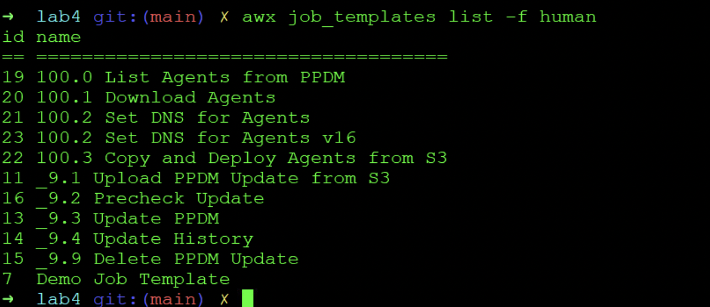
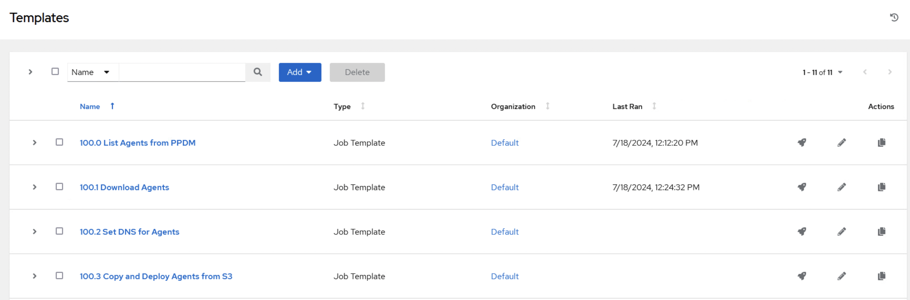
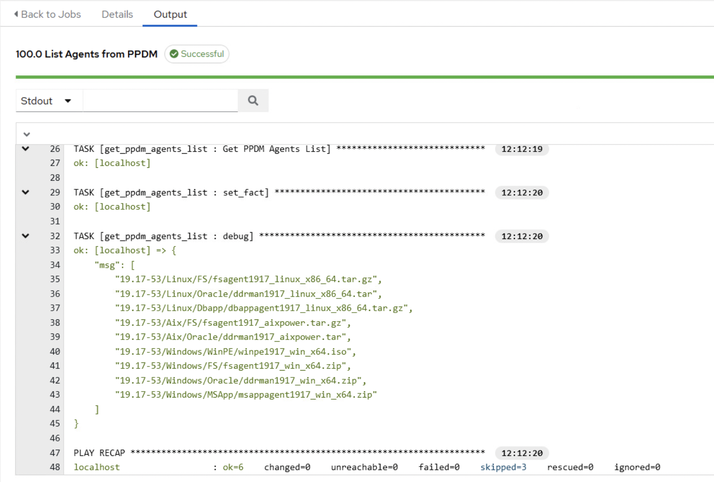
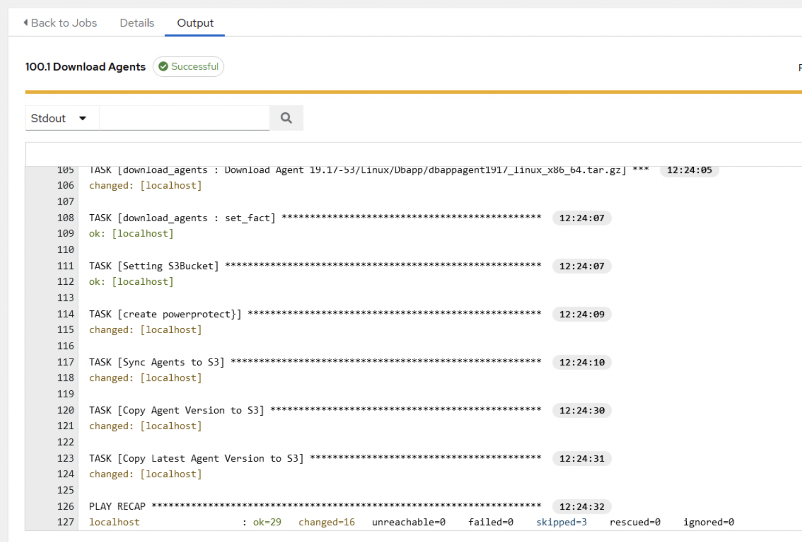
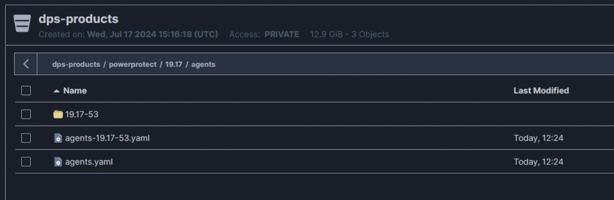
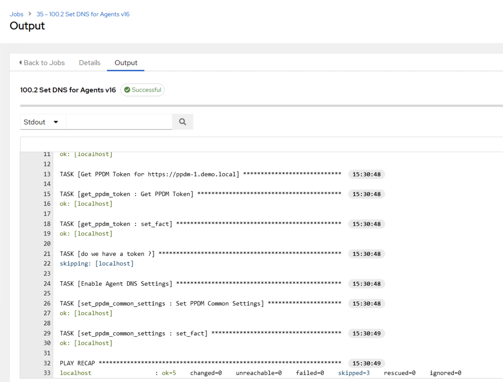

# AWX Buildup Agent Jobs
With this lab, we will deploy Templates to Retrieve the Agents from PPDM 

The execution environment for AWX will be evaluated from lab4 folder

```bash
cd ~/workspace/0499/lab4
direnv allow .
```

## Import Jobs

Ansible can Host Project Enfironments on SCM systems. We host our Inventory as well as the ansible_ppdm Modules on Github.  

To import them, we use:

```bash
awx import < agents.json
```
This should import The Jobs to view and download the Agents from PPDM.


```bash
awx job_templates list -f human
```





## Running the Jobs


100.0 List Agents from PPDM



This shows the available Agents from PPDM

100.1 Download Agents

This will download the Agents to S3

  

Below an Example on the Folder Structure created. An agents.yaml file will be stored and used as an inline variable for agent deployments.   



## Enabling DNS Resolution for Agents


To enable dns resolution for Agents on the PPDM, run the  100.2 Set DNS for Agents template ( Use v16 for PPDM19.16 and below ).


