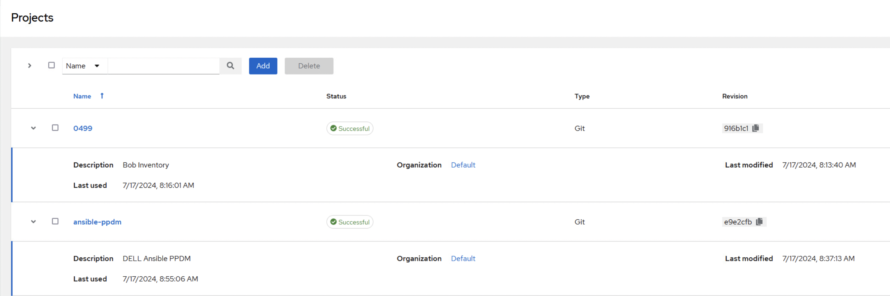

# AWX Buildup
With this lab, we will deploy Templates, Projects and Worklows to teh AWX Enfirnment, using the AWX CLI  

The execution environment for AWX will be evaluated from lab4 folder

```bash
cd ~/workspace/0499/lab4
direnv allow .
```

## Import Projects

Ansible can Host Project Enfironments on SCM systems. We host our Inventory as well as the ansible_ppdm Modules on Github.  

To import them, we use:

```bash
awx import < 0499.json
awx import < ansible-ppdm.json
```
This should import and sync the 0499 Project containing our Inventory as well the ansible_ppdm roles.


```bash
awx projects list -f human
```





## Importing the Inventory and the Inventory Source 


```bash
awx import < lab1_inventory.json
awx import < lab1.json
```

```bash
awx inventories list -f human
awx inventory_sources list -f human
```


## Importing the Uppdate Templates and Workflow

```bash
awx import < update_templates.json
awx import < workflow_update_ppdm.json
```


